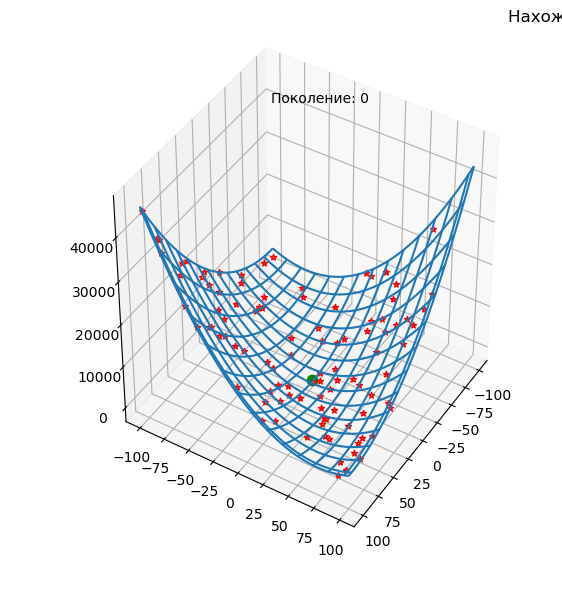
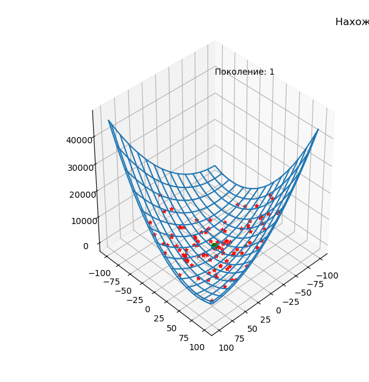

# Генетический алгоритм


`	`Генетические алгоритмы - это очень популярные в настоящее время способы решения задач оптимизации. В их основе лежит использование эволюционных принципов для поиска оптимального решения. 

`	`Генетические алгоритмы в основном применяются для решения задач оптимизации, т.е. задач, в которых есть некоторая функция нескольких переменных F(x1, x2, ... ,xn) и необходимо найти либо её максимум, либо её минимум. Функция F называется целевой функцией, а переменные - параметрами функции. Генетические алгоритмы "пришиваются" к данной задаче следующим образом.

`	`Параметры задачи являются генетическим материалом - **генами**. Совокупность генов составляет **хромосому**. Каждая **особь** обладает своей хромосомой, а, следовательно, своим набором параметров. Подставив параметры в целевую функцию, можно получить какое-то значение. То, насколько это значение удовлетворяет поставленным условиям, определяет характеристику особи, которая называется **приспособленностью** (fitness). Функция, определяющая приспособленность должна удовлетворять следующему условию: чем "лучше" особь, тем выше приспособленность. 

`	`Генетические алгоритмы работают с популяцией как правило фиксированного размера, состоящей из особей, заданных при помощи способа, описанного выше. Вот здесь начинается самое интересное. Особи "скрещиваются" между собой с помощью генетических операторов, естественно, получается потомство, причем часть потомков заменяют представителей более старого поколения в соответствии со стратегией формирования нового поколения. Кстати, выбор особей для скрещивания проводится согласно селективной стратегии (selection strategy). Так вот, заново сформированная популяция снова оценивается, затем выбираются наиболее достойные для скрещивания особи, которые "встречаются, влюбляются, женятся", получаются дети, занимают место престарелых индивидуумов и т.д.

`	`Вся эта карусель продолжается до тех пор, пока не найдется особь, гены которой представляют оптимальный набор параметров, при которых значение целевой функции близко к максимуму или минимуму, либо равно ему. Останов работы ГА может произойти также в случае, если популяция вырождается, т.е. если практически нет разнообразия в генах особей популяции, либо если просто вышел лимит времени. Вырождение популяции называют преждевременной сходимостью (premature convergence).

`	`**Ход работы:**

`	`Для решения задачи я взял функцию двух переменных (то есть у каждой моей особи будет хромосома с двумя генами), потому что ее можно показать на графике. Можно взять и функцию с большим количеством переменных, необходимо будет лишь изменить константу количества генов в хромосоме и соответственно изменить саму фитнес-функцию. 

`	`В константах программы следующие значения:

- POPULATION\_SIZE = 100 # количество индивидуумов в популяции
- MAX\_GENERATIONS = 200 # максимальное количество поколений
- P\_CROSSOVER = 0.9 # вероятность скрещивания
- P\_MUTATION = 0.1 # вероятность мутации индивидуума
- N\_VECTOR = 2 # количество генов в хромосоме
- LIMIT\_VALUE\_TOP = 100 # верхняя граница
- LIMIT\_VALUE\_DOWN = -100 # нижняя граница

`	`Фитнес-функция задается через функцию, и меняется в зависимости от задачи. 

```python
// python code
def fitness_function(f):
    return f[0] ** 2 + 1.5 * f[1] ** 2 - 2 * f[0] * f[1] + 4 * f[0] - 8 * f[1]
```

`	`В качестве индивидуума (особи) выступает класс, унаследованный от list, также у каждой особи есть поле *value* в котором храниться значение фитнес-функции, то есть значение целевой функции. 

```python
// python code
class Individual(list):
    def __init__(self, *args):
        super().__init__(*args)
        self.value = 0
```

*Рисунок  SEQ Рисунок \\* ARABIC 1. Класс особи*

` 	`Далее нам нужна функция, которая будет создавать нашу особь со случайными параметрами. 

```python
// python code
def individualCreator():
    return Individual([random.randint(LIMIT_VALUE_DOWN, LIMIT_VALUE_TOP) for i in range(N_VECTOR)])
```

`	`Далее функция, которая создает популяцию из наших особей. 

```python
// python code
def populationCreator(n=0):
    return list([individualCreator() for i in range(n)])
```

`	`Создаем популяцию, размерность которую мы указали в константах программы, вычисляем приспособленность каждой особи, (вычисление фитнес-функции), и эти значения записываем в каждую особь. 

```python
// python code

population = populationCreator(n=POPULATION_SIZE)

fitnessValues = list(map(fitness_function, population))

for individual, fitnessValue in zip(population, fitnessValues):
    individual.value = fitnessValue
```

`	`В итоге мы имеем популяцию особей размерностью POPULATION\_SIZE у каждой из которой в хромосоме N\_VECTOR генов. 

Для наглядности отсортируем популяцию по значению приспособленности и выведем на экран:

```python
// python code

population = populationCreator(n=POPULATION_SIZE)

fitnessValues = list(map(fitness_function, population))

for individual, fitnessValue in zip(population, fitnessValues):
    individual.value = fitnessValue
```

Этапы генетического алгоритма:

- Селекция (отбор)
- Скрещивание
- Мутация
- Новое поколение

`	`Селекция происходит таким образом: из всей популяции выбираются 4 случайные особи, из этих 4 выбирается более приспособленная особь и она добавляется в новую популяцию, и так до тех пор, пока новая популяцию не будет таких же размеров что и старая. Логично предположить, что в новой популяции будут попадаться одни и та же особи дважды, поэтому нужно ввести функцию клонирования, которая будет клонировать особи, для того, чтобы каждая особь представляла собой отдельный объект. 

```python
// python code

def clone(value):
    ind = Individual(value[:])
    ind.value = value.value
    return ind
```

Функция селекции выглядит следующим образом:

```python
// python code

def selection(popula, n=POPULATION_SIZE):
    offspring = []
    for i in range(n):
        i1 = i2 = i3 = i4 = 0
        while i1 in [i2, i3, i4] or i2 in [i1, i3, i4] or i3 in [i1, i2, i4] or i4 in [i1, i2, i3]:
            i1, i2, i3, i4 = random.randint(0, n - 1), random.randint(0, n - 1), random.randint(0,
                                                                                                n - 1), random.randint(
                0, n - 1)

        offspring.append(
            min([popula[i1], popula[i2], popula[i3], popula[i4]], key=lambda ind: ind.value))

    return offspring
```

`	`Этап скрещивания происходит таким образом: берем две особи, в их хромосомах случайным образом определяется граница, по которой будет разрез хромосомы, правые части хромосом меняются местами. Скрещивание завершено. 

```python
// python code

def crossbreeding(object_1, object_2):
    s = random.randint(1, len(object_1) - 1)
    object_1[s:], object_2[s:] = object_2[s:], object_1[s:]
```

`	`Мутация происходит с некой вероятностью, которая задается в константах программы. Сама мутация происходит следующим образом: проходимся по генам хромосомы, и с некой вероятностью изменяем ген на некоторое количество процентов в случайную сторону. 

```python
// python code

def mutation(mutant, indpb=0.04, percent=0.05):
    for index in range(len(mutant)):
        if random.random() < indpb:
            mutant[index] += random.randint(-1, 1) * percent * mutant[index]
```

Для основного цикла программы добавим счетчик поколений:

```python
// python code

generationCounter = 0
```

Основной цикл работы алгоритма:

- Увеличение счетчика поколения
- Селекция популяции
- Клонирование популяции (избежать одинаковых ссылок на объекты)
- Попарное скрещивание популяции
- Мутация популяции
- Вычисление нового значения фитнес-функции популяции
- Добавление значения фитнес-функции в каждую особь
- Вычисление лучшей, средней и худшей особи для постройки графика 
- Прорисовка всех особей на 3d графике для визуализации.
- Вывод данных в консоль




*Рисунок  SEQ Рисунок \\* ARABIC 2. Поколение 0*




*Рисунок  SEQ Рисунок \\* ARABIC 3. Поколение 1*


*Рисунок  SEQ Рисунок \\* ARABIC 4. Поколение 2*


*Рисунок  SEQ Рисунок \\* ARABIC 5. Поколение 7*


*Рисунок  SEQ Рисунок \\* ARABIC 6. Поколение 35*


*Рисунок  SEQ Рисунок \\* ARABIC 7. Поколение 76*


*Рисунок  SEQ Рисунок \\* ARABIC 8. График работы 200 поколений.*

